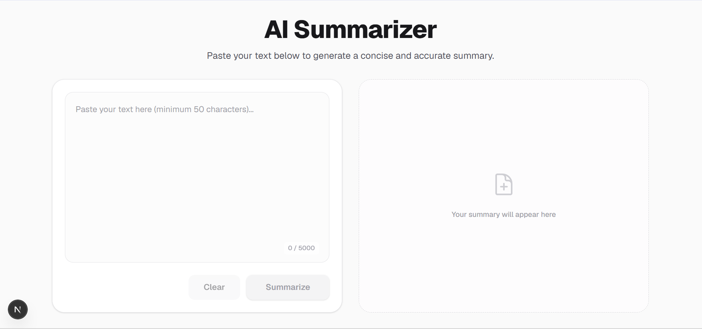
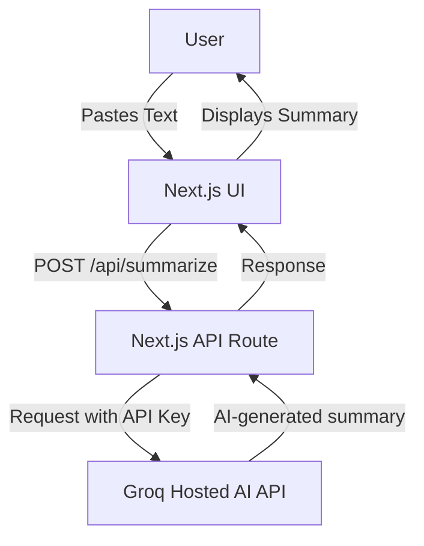

# AI Summarizer

AI Summarizer is a modern, responsive web application built with Next.js that allows users to quickly generate concise and accurate summaries from large bodies of text. It uses the Groq API to power its incredibly fast and highly capable AI backend.



## Features

- **Blazing Fast Summarization:** Powered by the Groq API for near-instant AI inference.
- **Modern UI:** Clean, responsive, and intuitive interface that works seamlessly on desktop and mobile.
- **Dark/Light Mode:** Automatically respects your system preferences, with a toggle to switch manually.
- **Copy to Clipboard:** One-click copy functionality to quickly grab your generated summary.
- **Word Count & Validations:** Built-in character and word tracking to ensure inputs and outputs meet expected lengths.

## How the Application Works

1. The user pastes text (minimum 50 characters) into the input area.
2. Clicking "Summarize" sends a POST request with the text to the Next.js API route.
3. The API route securely communicates with the Groq API using a server-side API key.
4. Groq processes the text and streams or returns the generated summary.
5. The frontend displays the summary in a clean, copyable format.

## Architecture & Request Flow



## Tech Stack

- **Framework:** [Next.js](https://nextjs.org/) (App Router)
- **Styling:** [Tailwind CSS v4](https://tailwindcss.com/)
- **AI Integration:** [Groq SDK](https://console.groq.com/)
- **Language:** TypeScript
- **Deployment:** Vercel

## Local Installation

1. **Clone the repository:**
   ```bash
   git clone https://github.com/sheda3838/ai-summarizer.git
   cd ai-summarizer/project
   ```

2. **Install dependencies:**
   ```bash
   npm install
   ```

## Environment Setup

To run this project, you will need a Groq API Key. 

1. Create a file named `.env.local` in the root of the `project` directory.
2. Add your Groq API key:
   ```env
   GROQ_API_KEY=your_groq_api_key
   ```

> [!IMPORTANT]
> **Never commit `.env.local` to version control.**
> **Never prefix the Groq key with `NEXT_PUBLIC_`.** This keeps the API key strictly on the server side and prevents it from being leaked to the browser.

## Running the Project Locally

Start the development server:

```bash
npm run dev
```

Open [http://localhost:3000](http://localhost:3000) with your browser to see the result.

## Production Deployment

The easiest way to deploy your Next.js app is to use the [Vercel Platform](https://vercel.com/new).

1. Push your code to a GitHub repository.
2. Import the project into Vercel.
3. In the Vercel dashboard, go to the Project Settings > Environment Variables.
4. Add the `GROQ_API_KEY` environment variable.
5. Deploy!

## Project Structure

- `app/page.tsx`: The main frontend interface containing the layout, form, and client-side logic.
- `app/layout.tsx`: Root layout defining the HTML structure, fonts, and theme initialization.
- `app/api/summarize/route.ts`: The secure backend endpoint that communicates with Groq.

## API Endpoint Explanation

**`POST /api/summarize`**
Accepts a JSON payload containing the `text` to be summarized. It validates the input length server-side and then uses the `groq-sdk` to request a summarization task from the AI model. It returns the resulting summary text.

## Security Note

The Groq API key (`GROQ_API_KEY`) is completely secure and stays on the server-side. Because it is accessed entirely within the Next.js API Route (`/api/summarize`), it is never exposed to the client or transmitted via the frontend bundles. 

## Future Improvements

- Add support for file uploads (PDF, DOCX) to summarize documents.
- Allow users to select different model sizes or summarization styles (e.g., bullet points vs. paragraphs).
- Add user authentication to save past summaries.

## Contributing

Contributions are welcome! If you'd like to improve the AI Summarizer, please open an issue to discuss your proposed changes or submit a pull request directly.
